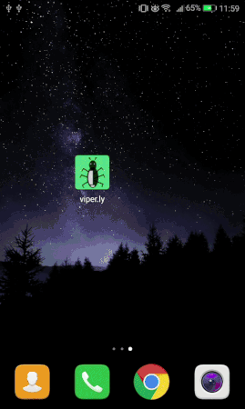
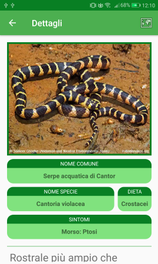
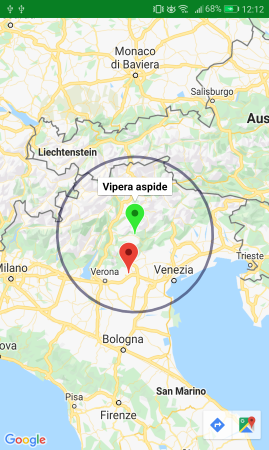
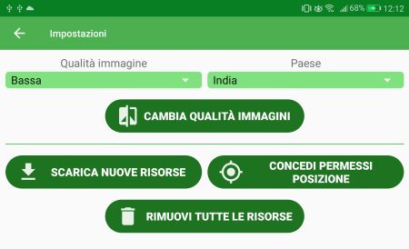

<h1>DESCRIZIONE

viper.ly è un'applicazione pensata per i mercati emergenti che vuole fornire un aiuto nell'identificare specie di animali, insetti e piante
pericolosi per l'uomo. Un utente può perciò scaricare uno o più pacchetti di risorse, ognuno corrispondente a una certa nazione, contenenti immagini e database di informazioni.

La prima funzionalità fornita è quella di visualizzare tutte le specie per una certa nazione, suddivise nelle 3 categorie Animali, Insetti, Piante.
La lista riporta il nome comune della specie e l'utente può filtrare gli elementi per il loro nome, per poter trovare più in fretta l'elemento voluto.

Per ogni specie è inoltre presente una seconda schermata, relativa ai dettagli. Qui viene mostrata la foto con dimensioni maggiori, vengono riportate ulteriori
informazioni come il nome latino, la dieta (per animali e insetti), i sintomi causati dal contatto (morso, puntura, ingestione o contatto con la pelle) e una
descrizione approfondita della specie in questione. È inoltre possibile visualizzare in una mappa le aree in cui è più probabile incontrare la determinata specie,
mostrando anche la posizione del dispositivo, se disponibile.

 

La seconda funzione importante fornita dall'app è la possibilità di ricercare una determinata specie in base ai sintomi. Poniamo per esempio di essere stati morsi
da un serpente che non sappiamo riconoscere. Inserendo nella schermata la nazione in cui ci si trova, il tipo di contatto, la categoria e selezionando tutti i sintomi
che si provano, possiamo sperare di restringere il campo di ricerca e di trovare il serpente che ci ha morso, potendo così fornire queste informazioni al personale medico
che dovrà occuparsi di noi.

Ottimizzazioni applicate

Essendo un'applicazione realizzata secondo le linee guida Build for Billions, vengono inoltre applicate diverse ottimizzazioni secondo le linee guida fornite da Google.

**DIMENSIONI DELL'APK**

1. Abilitato code e resource shrinking.
2. La maggiorparte delle icone utilizzate sono in formato vettoriale.
3. Solo italiano e inglese sono incluse nei file di traduzione per le stringhe. Altre lingue potrebbero essere supportate dinamicamente attraverso gli App Bundle, ma ciò non
viene realizzato dalla nostra app.
4. L'applicazione arriva senza nessuna foto o database disponibile (sono presenti all'interno delle risorse solo per simulare il download).
Un utente che vuole utilizzare l'applicazione deve per forza scaricare almeno un pacchetto relativo a una nazione, in questo modo viene scaricato dal Play Store solo il minimo indispensabile.

**SPAZIO OCCUPATO DOPO L'INSTALLAZIONE**

1. Il download delle risorse seleziona automaticamente la destinazione all'interno del File System, privilegiando eventuali schede sd che si assume siano più
spaziose della memoria interna del dispositivo.
2. Il download delle risorse permette di selezionare la qualità delle immagini scaricate (Alta, Media, Bassa). Ogni immagine è inoltre in formato .webp per
ridurre ulteriormente la quantità di spazio occupata.
3. In ogni momento è possibile dalle impostazioni cambiare la qualità delle immagini scaricate, eventualmente riducendola per liberare spazio.
4. Per ogni nazione viene mantenuto un solo database. In caso di un cambio di lingua di sistema un download di nuove risorse sovrascrive il database presente.
5. Per visualizzare le foto viene usata la libreria Glide. Essa mantiene nella memoria interna al dispositivo una cache contenente le immagini decodificate, per poterle caricare
più in fretta. Come descritto nel report il sistema Android gestisce automaticamente questo tipo di cache, assegnando dinamicamente a ogni app una quantità di spazio in base
all'utilizzo che ne fa l'utente. In caso di necessità inoltre questi file vengono eliminati in modo automatico.

**CONNESSIONE A INTERNET E AI SERVIZI DI LOCALIZZAZIONE**

1. Prima del download l'applicazione verifica il tipo di connessione in uso. Se viene rilevata una connessione a consumo l'utente viene avvertito, in modo che possa
decidere se continuare con il download o se rimandarlo a quando sarà disponibile una connessione meno costosa e con meno limiti.
2. Una volta scaricate le risorse necessarie, l'applicazione funziona completamente offline.
3. Per la visualizzazione delle zone in cui una specie è presente, le coordinate sono prese direttamente dal database.
Per quanto riguarda le coordinate del dispositivo, queste vengono prese dalla cache del servizio di localizzazione e non viene mai richiesta esplicitamente una nuova posizione.
Se la posizione non è disponibile ci si limita a mostrare quella della specie. In sostanza questa funzione non richiede mai di attivare il GPS.

**MEMORIA RAM**

1. Le componenti dell'app rispondono ai metodi di ComponentCallbacks2 e liberano risorse quando il sistema lo richiede.
2. La libreria Glide, utilizzata per visualizzare le foto, risponde anch'essa a ComponentCallbacks2 e ridimensiona le cache in RAM in caso di necessità.
3. Si è cercato di utilizzare il Memory Profiler di Android Studio per rilevare eventuali memory leaks. Ammettendo di non essere ferrati in materia,
ci siamo affidati alle analisi del profiler, che non ne ha individuati.

**PRESTAZIONI**

1. Vista la possibilità di avere più database, viene mantenuta una cache di istanze aperte per ogni diverso database aperto per evitare di caricarli continuamente  
dalla memoria di massa.
2. L'utilizzo di Glide migliora visibilmente le prestazioni su dispositivi poco performanti caricando le immagini con qualità diverse in base alle dimensioni di
visualizzazione. Inoltre vengono evitate numerose chiamate al garbage collector riutilizzando aggressivamente la memoria già allocata.

**SUPPORTO PER SCHERMI DI VARIE DIMENSIONI**

1. I layout sono stati testati e adattati per schermi con un range abbastanza vario di dimensioni, senza però includere risorse diverse per ogni tipo di schermo.

